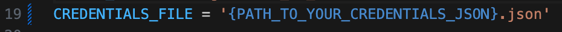

# How to reproduce everything

## Set up a service account for any project (purely for the credentials)

-> https://console.cloud.google.com/apis/credentials

A little bit less practical than simply allowing OAuth 2.0 to do whatever with your spreadsheets, but should work just fine.

## Clone the repository

```bash
git clone https://github.com/psilva8769/tunts-rocks-2024.git
```

## Set up your credentials

Go to **main.py**, and look for the following variable:
```py
CREDENTIALS_FILE = '{PATH_TO_YOUR_CREDENTIALS_JSON}.json'
```


## Set up the spreadsheet ID

In my case, it is already set to the one I copied.
```py
SHEET_ID = '1Tx0swikem8WWTHEqTrvIB4okJpLEQ9fpLogy4K02JiY'
```

If the sheet you are using was simply copied like mine, no other changes should be needed. (Read range, result write range, etc)

## Open the console and use the following commands

### Start the virtual environment
```bash
source tuntsrocks2024/bin/activate
```

### Execute the script
```bash
python main.py
``` 

If you are on a different OS, you might want to try python3 instead